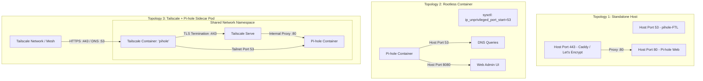

# 🛡️ Pi-hole Universal Deployer for Linux

[](https://opensource.org/licenses/MIT)
[](https://www.gnu.org/software/bash/)
[](https://kernel.org)
[](https://podman.io)
[](https://tailscale.com)

A robust, idempotent, and production-ready Linux automation tool that deploys and manages **Pi-hole** across three distinct topologies:

1. **Standalone Host OS** with optional automated Let's Encrypt HTTPS (via Caddy reverse proxy).
2. **Rootless Containers (Podman / Docker)** with automated kernel `sysctl` unprivileged port 53 allocation, `systemd-resolved` conflict resolution, and boot persistence.
3. **Containerized Pi-hole + Tailscale Sidecar** with automated Let's Encrypt TLS termination (`tailscale serve`), OAuth Client & Auth Key support, and Pi-hole v6 port 443 conflict resolution.

---

## 📐 Architecture Overview



---

## ✨ Features & Idempotency Guarantees

* **Automated Port 53 Resolution:** Fixes the common Linux issue where rootless containers cannot bind privileged ports `< 1024` by configuring `net.ipv4.ip_unprivileged_port_start=53`.
* **Systemd-Resolved Stub Isolation:** Automatically resolves port 53 binding conflicts with `systemd-resolved` by creating drop-in overrides (`DNSStubListener=no`).
* **Pi-hole v6 HTTPS Conflict Avoidance:** In shared network pods (Tailscale sidecars), prevents Pi-hole's built-in self-signed TLS server from colliding with Tailscale Serve by setting `FTLCONF_webserver_port=80`.
* **Tailscale OAuth & Reusable Auth Keys:** Auto-detects `tskey-client-*` vs `tskey-auth-*` keys and automatically configures `--advertise-tags`.
* **Interactive TUI Wizard & CLI Flags:** Run interactively or automate via command-line arguments.
* **Built-in Diagnostics & Testing:** Includes `--healthcheck` and a test suite.

---

## 🚀 Quick Start

### 1. Clone & Run Interactively
```bash
git clone https://github.com/vijayet1/pihole-universal-deployer.git
cd pihole-universal-deployer
./pihole-deploy.sh
```

---

## 📖 CLI Usage & Topologies

### Topology 1: Standalone Host with Let's Encrypt HTTPS
Installs Pi-hole natively on the host OS and sets up Caddy for automated SSL certificates:
```bash
./pihole-deploy.sh \
  --mode standalone \
  --domain "pihole.yourdomain.com" \
  --password "YourStrongPassword123!"
```

### Topology 2: Rootless Container (Podman / Docker)
Deploys a rootless container stack with automatic sysctl/systemd port 53 fixes:
```bash
./pihole-deploy.sh \
  --mode container \
  --dir ~/pihole \
  --port 8080 \
  --password "YourStrongPassword123!"
```

### Topology 3: Tailscale Sidecar Pod (Automated TLS & OAuth)
Deploys the paired Tailscale + Pi-hole pod with zero host port conflicts and clean HTTPS on port 443:
```bash
# Using a Standard Reusable Auth Key
./pihole-deploy.sh \
  --mode tailscale \
  --dir ~/pihole \
  --tailscale-key "tskey-auth-kXXXXX" \
  --password "YourStrongPassword123!"

# Or using an OAuth Client Secret
./pihole-deploy.sh \
  --mode tailscale \
  --dir ~/pihole \
  --tailscale-key "tskey-client-kXXXXX" \
  --tailscale-tag "tag:pihole" \
  --password "YourStrongPassword123!"
```

---

## 🔍 Diagnostics & Testing

```bash
# Run healthcheck on existing deployment
./pihole-deploy.sh --healthcheck

# Run automated test suite
./tests/test_deployer.sh
```

---

## 📄 License

This project is licensed under the [MIT License](LICENSE).
