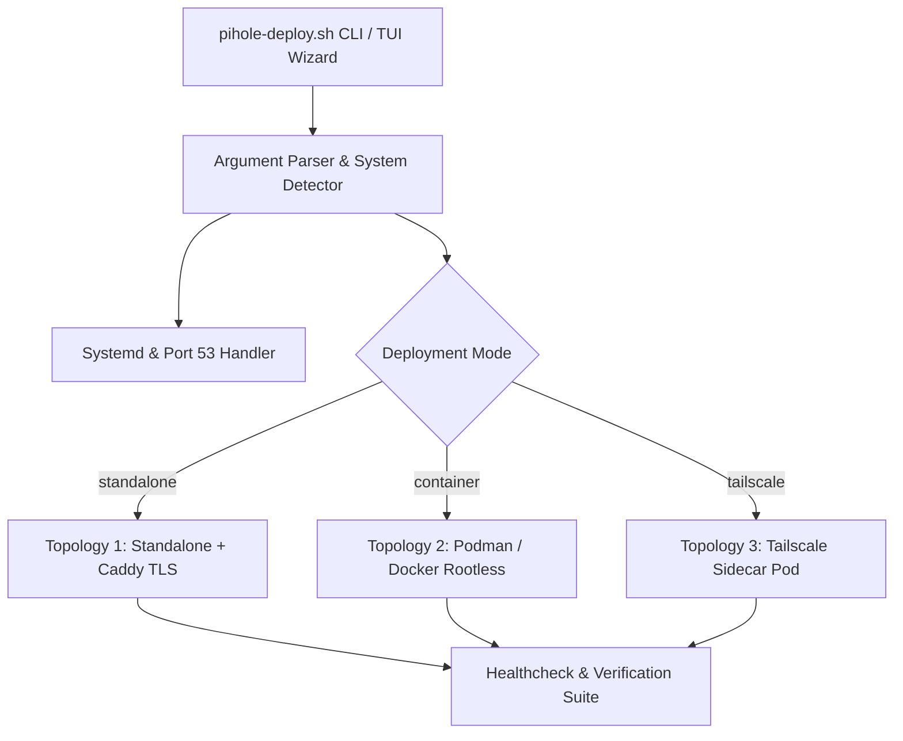

# Architecture & Design Specification: Universal Pi-hole Linux Deployer

- **Document ID:** `SPEC-2026-08-29-PIHOLE-DEPLOYER`
- **Author:** Antigravity AI
- **Date:** 2026-08-29
- **Status:** Approved / In-Development

---

## 1. Overview & Core Objectives

The Universal Pi-hole Deployer (`pihole-deploy.sh`) is a production-grade, idempotent automation tool designed to install, configure, and maintain Pi-hole across three distinct Linux deployment topologies:

1. **Topology 1: Standalone Host OS** with optional automated Let's Encrypt HTTPS (via Caddy reverse proxy).
2. **Topology 2: Rootless Container Stack (Podman / Docker)** with automated kernel sysctl unprivileged port 53 management, `systemd-resolved` conflict resolution, and user linger boot persistence.
3. **Topology 3: Containerized Pi-hole + Tailscale Sidecar** with automated Let's Encrypt TLS termination on port 443 via Tailscale Serve, OAuth / Auth Key handling, and Pi-hole v6 port 443 collision avoidance.

---

## 2. Requirements & Edge-Case Architecture

### 2.1 Kernel & System Port 53 Handling
- **Constraint:** By default, Linux kernels enforce `ip_unprivileged_port_start=1024`. Rootless Podman/Docker cannot bind port 53 without privilege adjustment.
- **Solution:** Idempotently create `/etc/sysctl.d/50-pihole-unprivileged-ports.conf` containing `net.ipv4.ip_unprivileged_port_start=53` and apply `sysctl --system`.

### 2.2 Systemd-Resolved Port 53 Conflicts
- **Constraint:** Default `systemd-resolved` configurations bind `127.0.0.53:53` and extra stubs (e.g. `172.17.0.1:53`), preventing `0.0.0.0:53` DNS binding.
- **Solution:** Create `/etc/systemd/resolved.conf.d/no-stub.conf` with `DNSStubListener=no`, disable conflicting stubs (`20-docker-dns.conf.disabled`), and restart `systemd-resolved`.

### 2.3 Pi-hole v6 Port 443 Conflict in Shared Network Namespaces
- **Constraint:** In Pi-hole v6, `pihole-FTL` binds `80` AND `443` (with internal self-signed TLS) by default. In Tailscale sidecar pods (`network_mode: "service:tailscale"`), this collides with Tailscale Serve trying to bind port 443 for valid Let's Encrypt TLS, resulting in `502 Bad Gateway`.
- **Solution:** Explicitly pass `FTLCONF_webserver_port=80` in `docker-compose.yml` so `pihole-FTL` only listens on port 80, leaving port 443 for Tailscale Serve.

### 2.4 Tailscale OAuth vs Auth Key Differentiation
- **Constraint:** Tailscale OAuth Client Secrets (`tskey-client-...`) reject device registration with `403` unless `--advertise-tags=tag:<name>` is passed. Standard Auth Keys (`tskey-auth-...`) do not require this.
- **Solution:** Detect `tskey-client-` prefix in the provided key and automatically append `TS_EXTRA_ARGS=--advertise-tags=${TAILSCALE_TAG}`.

---

## 3. CLI & Modular Component Architecture

---

## 4. File Structure & Distribution
- Main Executable: `/home/guptavi/Work/pihole-deploy.sh`
- Test Suite: `/home/guptavi/Work/tests/test_deployer.sh`
- Documentation: `/home/guptavi/Work/docs/superpowers/specs/2026-08-29-pihole-universal-deployer-design.md`
- Implementation Plan: `/home/guptavi/Work/docs/superpowers/plans/2026-08-29-pihole-universal-deployer.md`
